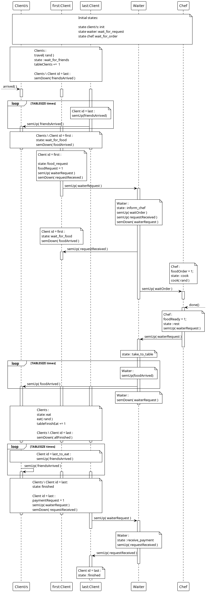

# Introdução

Um grupo de amigos combinou um jantar num restaurante onde apenas existe um empregado de mesa e um cozinheiro.

Representando cada entidade deste cenário por um processo, o objétivo deste trabalho é utilizar mecanismos de sincronização de modo representar o fluxo e as relações pretendidas entre os vários intervenientes.

## Regras

- O primeiro cliente apenas faz o pedido ao empregado, depois de todos os seus colegas chegarem.

- O empregado deve levar o pedido ao cozinheiro e trazer a comida quando estiver pronta.

- Os Clientes devem apenas abandonar a mesa depois de todos terminarem a sua refeição.

- O ultimo a acabar de comer têm de pedir a conta ao empregado.

- Sincronização feita através de semáforos e memória partilhada.

- Todos os processos são criados no inicio do programa.

- Os processos estão ativos apenas quando necessários.

## Ciclo de vida

Nesta secção vamos examinar os ciclos de vida dos varios processos ,como interagem e como é coordenado o seu acesso à a memoria partilhada.

- **Cliente**
  
  O cliente começa num estado de espera imposto por si mesmo, que é o tempo que demora a chegar ao restaurante.
  
  Depois de chegar ao retaurante, este espera até que os outros tenham chegado.
  
  Após todos terem chegado, o primeiro cliente fára o pedido, sinalando o empregado, enquanto todos os outros clientes estão em espera.
  
  Depois da comida chegar, quando um dos clientes acaba de comer, este espera pelos os outros.
  
  O ultimo a acabar a refeição têm a responsablidade de notificar o empregado e pagar a conta.
  
  ```c
  ...
  
  travel(n);
  bool first = waitFriends(n);
  if (first) orderFood(n);
  waitFood(n);
  eat(n);
  waitAndPay(n);
  
  ...
  ```

- **Empregado de mesa**
  
  O ciclo de vida do empregado revolve á volta de responder a 3 tipos de pedidos.
  
  - Entregar os menus escolhidos ao chefe
  - Entregar a comida aos clientes
  - Receber o pagamento
  
  O primeiro pedido acontece após todos os clientes terem chegado, recebendo um sinal do primeiro cliente a chegar. 
  Aqui a responsabidade do empregado é notificar o chefe.
  
  O segundo acontece, ao ser notificado pelo chefe que a comida está pronta, começando a distribuir os pratos aos clientes.
  
  O treceiro leva ao ultimo estado do empregado, onde é pedida a conta. A partir deste ponto tanto a rotina do empregado como a de todos os clientes da-se por terminada.
  
  ```c
  ...
  
  while(nReq<3) {
          req = waitForClientOrChef();
          switch(req) {
              case FOODREQ:
                    informChef();
                    break;
              case FOODREADY:
                    takeFoodToTable();
                    break;
              case BILL:
                    receivePayment();
                    break;
          }
          nReq++;
      }
  
  ...
  ```

- **Chefe**
  
  Sendo o ciclo mais curto, a rotina deste de processo apenas começa quando é sinalizado pelo empregado que os clientes já fizeram os seus pedidos.
  
  Após ser sinalizado, o cozinheiro vai fazer a sua função, permanecendo neste estado por um determinado intervalo de tempo aleatório.
  
  Ao acabar de cozinhar os pedidos este notifica o empregado para levar os pratos para os clientes.
  
  ```c
  ...
  
    waitForOrder();
    processOrder();
  
  ...
  ```

## Fluxos e relações

Antes de _"meter as mãos na massa"_ e alterar o codigo que nos fornecido, tivemos que modelar e defenir os fluxos entre os vários intrevenientes.

Os estados inicias de cada um dos intrevenientes são os seguintes:

- Clientes : `init`

- Waiter : `wait_for_request`

- Chef : `wait_for_order`

O trigger da ação é a chegada dos clientes ao restaurante.

#### Chegada dos clientes

Quando um cliente chega a mesa reservada, este incrementa a variável `tableClients`, que nos indica quantos clientes já chegaram, e espera pelos seus colegas executando `semDown( friendsArrived )`.

```c
...

if (semDown(semgid,sh->friendsArrived) == -1) {
    perror("error on the down operation for semaphore acces(C");               
    exit(1);
}

...
```

O id do primeiro cliente é guardado para posteriormente ser chamado para fazer o pedido, quando todos os seus colegas tiverem chegado.

```c
...

bool first = waitFriends(n);
if (first) orderFood(n);

...
```

O ultimo cliente a chegar executa `semUp( friendsArrived )`, de modo a libertar todos os outros clientes do estado de espera, por cada cliente até `TABLESIZE`.

```c
...

if (sh->fSt.tableClients == TABLESIZE) {

    for (int i = 0; i < TABLESIZE; i++) {
        semUp(semgid,sh->friendsArrived);
    }

    sh->fSt.tableLast = id;

}

...
```

### Cliente chama empregado

O primeiro cliente sinaliza o empregado para entregar os seus pedidos ao chefe.

Esse sinal é feito atravéz do semáforo semaforo `waiterRequest` e da flag `foodRequest`.

```c
...

  sh->fSt.foodRequest = 1; 
  semUp(semgid,sh->waiterRequest);

...
```

Para esperar pelo empregado este executa `semDown( requestReceived )`

```c
...

if (semDown(semgid,sh->requestReceived) == -1) {
    perror("error on the down operation for semaphore access (CT)");               
    exit(1);
}

...
```

Depois de receber a confirmação da entrega do pedido, junta-se aos outros clientes, e espera com eles pela comida.

```c
...
if (semDown(semgid,sh->foodArrived) == -1) { 
  perror ("error on the down operation for semaphore access (CT)");
  exit (EXIT_FAILURE);
}

...
```

### Empregado entrega pedido ao chefe

Depois de ser receber o sinal do cliente, o empregado, verifica o tipo de pedido, através das seguintes flags.

- foodRequest
- foodReady
- paymentRequest

Neste caso, a flag estabelecida no ponto anterior é a foodRequest, pelo que a responsabilidade do empregado é entregar o pedido dos clientes ao chefe.

```c
...

  if(sh->fSt.foodRequest == 1){
    sh->fSt.foodRequest = 0;
    ret = 1;
  } 
  if(sh->fSt.foodReady == 1){
    sh->fSt.foodReady = 0;
    ret = 2;
  } 
  if(sh->fSt.paymentRequest == 1){
    sh->fSt.paymentRequest = 0;
    ret = 3;
  }

...
```

:::{ .callout-note }

# nota

Estando identificada a flag associada ao pedido, a mesma é desactivada para não interferir na identificação de outros pedidos.
:::

Defenida a sua responsabilidade o empregado, muda o seu estado para `inform_chef` e sinaliza o chefe , executando `semUp( waitOrder )`.

 Além de sinalizar o chefe, o empregado, também sinaliza cliente que o pedido já foi transmitido executando `semUp( requestReceived )`, libertando assim este semáforo para ser depois utilizado pelo chefe.

```c
...

  sh->fSt.st.waiterStat = INFORM_CHEF;


  if (semUp(semgid,sh->waitOrder) == -1) {
      perror("error on the down operation for semaphore access (WT)");                
      exit(1);
  }

  if (semUp(semgid,sh->requestReceived) == -1) {
      perror("error on the down operation for semaphore access (WT)");                    
      exit(1);
  }

...
```

### Chefe cozinha pedido e chama empregado

Este ponto é composto pelo o total do ciclo de vida do chefe.

Estando já á espera do empregado atravéz so semáforo `waitOrder`.

```c
...

if (semDown (semgid, sh->waitOrder) == -1){                                                      
    perror ("error on the up operation for semaphore access (PT)");
    exit (EXIT_FAILURE);
} 

...
```

Após o sinal do empregado para cozinhar os pedidos este, muda o seu estado e prossegue para a _"cozinha"_.

```c
...

sh->fSt.st.chefStat = COOK;

...
```

Passado um intrevalo aleatório, o cozinheiro acaba de preparar o jantar, muda para o seu estado final, sinaliza o empregado para entregar os pratos e acaba a sua rotina.

```c
...

sh->fSt.foodReady = 1;
sh->fSt.st.chefStat = REST;

...

if (semUp (semgid, sh->waiterRequest) == -1) {
  perror ("error on the up operation for semaphore accessPT");
  exit (EXIT_FAILURE);
}
```

### Empregado entrega os pratos

Ao receber a sinal do chef para servir os pratos, o empregado, muda o seu estado para `take_to_table`, e incrementa num loop o semáforo `foodArrived` que liberta os clientes do estado de espera.

```c
  ...

  sh->fSt.st.waiterStat = TAKE_TO_TABLE;
  for (int i = 0; i < TABLESIZE; i++) {
      if (semUp(semgid,sh->foodArrived) == -1) {
          perror("error on the down operation for semaphore access (WT)");               
          exit(1);
      }
  }

  ...
```

### Clientes comem e pedem conta

Já servidos, agora, tudo o que os clientes têm a fazer é simplesmente comer, atualizando o estado para `eat`.

```c
...

sh->fSt.st.clientStat[id] = EAT;

eat(n);

...
```

Ao terminar a refeição cada membro do grupo incrementa a variável `tableFinishEat` que será utilizada para identificar quem irá pagar a conta, portanto, o ultimo a terminar.

E ficam á espera que todos terminem executando `semDown( allFinised )`

```c
...

sh->fSt.tableFinishEat += 1;
...
if (sh->fSt.tableLast == id){
  last = true;
}
...
if (semDown (semgid, sh->allFinished) == -1) {
  perror ("error on the down operation for semaphore access (CT)");
  exit (EXIT_FAILURE);
}

...
```

Quando o ultimo cliente terminar, este vai sinalizar a empregada com a flag `paymentRequest`, mudando o seu estado para `wait_for_bill`, e ficando á espera da sua resposta executando `semDown( requestReceived )`

```c
...
if(last) {
  ...
  sh->fSt.st.clientStat[id] = WAIT_FOR_BILL;
  ...
  if (semUp (semgid, sh->waiterRequest) == -1) {
    perror ("error on the down operation for semaphore access (CT)");
    exit (EXIT_FAILURE);
  }
  ...
  if (semDown(semgid,sh->requestReceived) == -1) {
    perror("error on the down operation for semaphore access (CT)");               
    exit(1);
  }

}
```

### Todos para casa

 Ao receber o sinal, assim como acima exemplificado o empregado confirma o tipo de pedido, verifica que se trata do pedido da conta.

 Aqui o empregado simplemente assume o seu ultimo estado, `receive_payment`, liberta o semáforo `requestReceived` e dá por concluida a sua rotina.

```c
...
sh->fSt.st.waiterStat = 3;
...
if (semUp(semgid,sh->requestReceived) == -1) {
 perror("error on the down operation for semaphore access (WT)");             
 exit(1);
}
```

 Recebendo a confirmação do empregado, o ultimo cliente, simplesmente liberta o semáforo `allFinised` executando num loop `semUp( allFinised )`.

```c
if (sh->fSt.tableFinishEat == TABLESIZE) {
   for (int i = 0; i < TABLESIZE; i++ ) {
     semUp(semgid,sh->allFinished);
   }
 }
```

 Finalmente todos os clientes actualizam os seu estado para `finished` e dão a sua rotina por concluída.

```c
...

sh->fSt.st.clientStat[id] = FINISHED;

...
```

## Diagrama de fluxos

 Todas as relações e fluxos estão aqui representadas neste diagrama.

{fig-align="center"}

# Conclusão

Em suma, com este trabalho fiquei com uma melhor prepétiva de o quão vital é conceito de sincronização de processos no acesso de recursos partilhados, e dos mecanismos de linux e unix em geral que permitem esta mesma sincronização.

# Outros

> [Repositório](https://github.com/tiag0-portugal/dinner_party)
